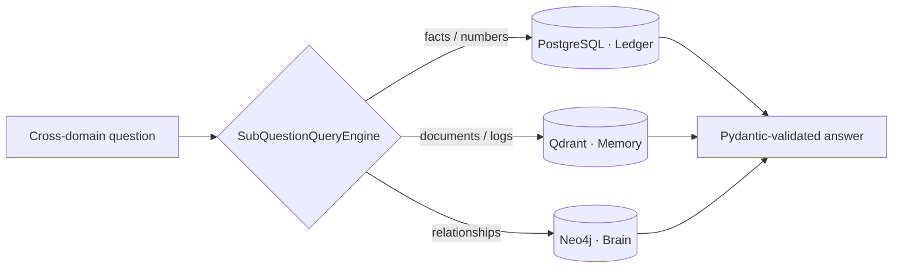
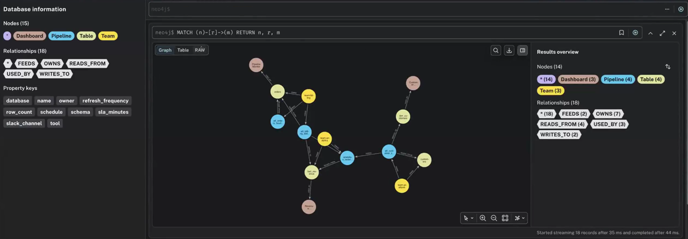
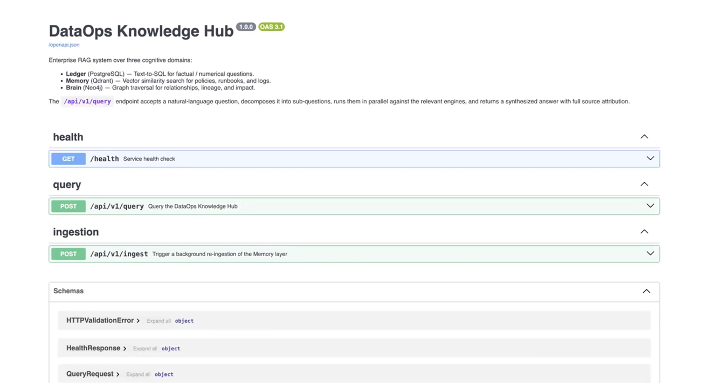
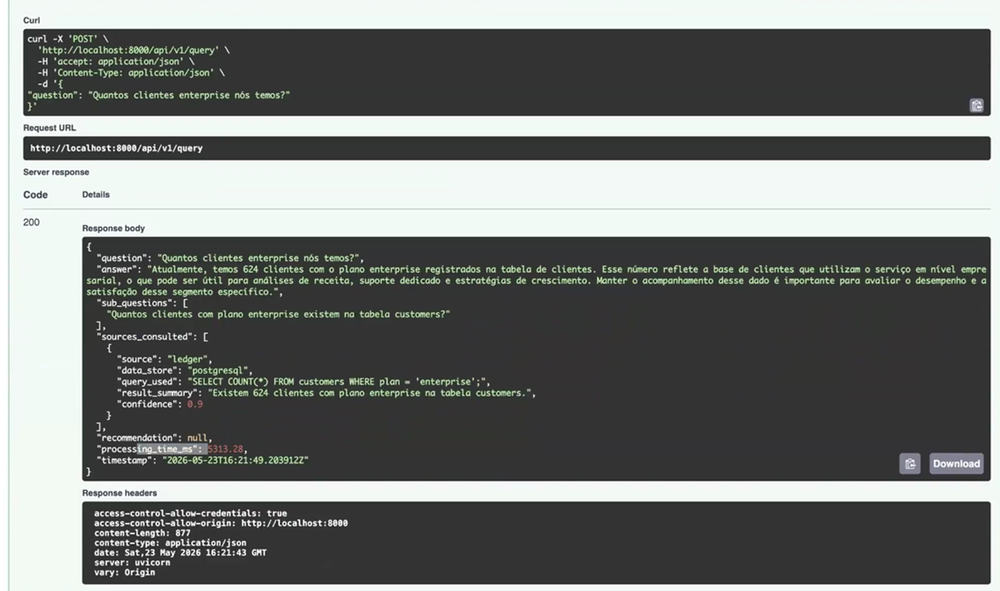
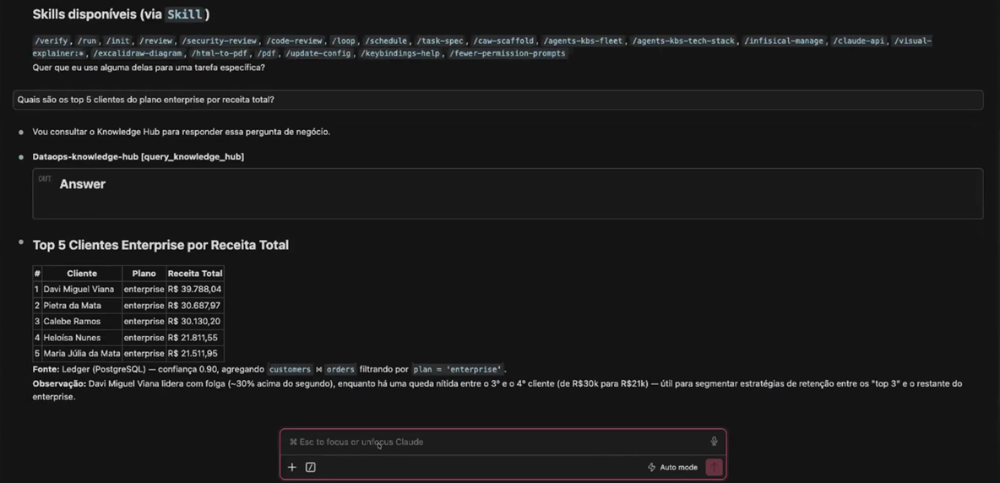
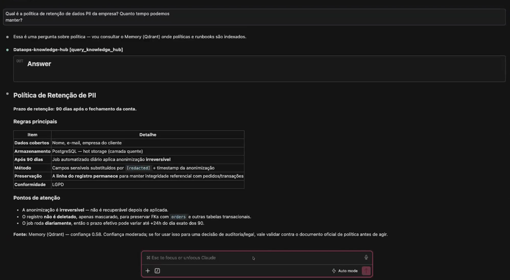

# DataOps Knowledge Hub

**English** · [Português](README.pt-br.md)

A multi-source RAG that routes each question to the store best suited to answer it -
exact facts to SQL, semantic search to a vector store, relationships to a graph.
Built with **LlamaIndex** and **Pydantic** during my AI Data Engineer specialization.

## Why three stores?

A single vector store answers *"what is similar?"* well — but hallucinates on
*"how many?"* and can't traverse *"what is connected to what?"*. Each query goes to
the engine built for it:

| Tier | Store | Answers | LlamaIndex engine |
|---|---|---|---|
| **Ledger** | PostgreSQL | exact / numeric / transactional | `NLSQLTableQueryEngine` (text-to-SQL) |
| **Memory** | Qdrant | semantic / documents / logs | `VectorStoreIndex` |
| **Brain** | Neo4j | relationships / lineage | `PropertyGraphIndex` (Cypher) |

A **`SubQuestionQueryEngine`** sits on top: it decomposes a cross-domain question into
sub-questions, routes each to the right engine, and merges the results. Every LLM
output is coerced into a **typed Pydantic schema** - no raw strings.

> **One question, all three stores:**
> *"Which enterprise customers spent over R$50k, had pipeline incidents, and what
> downstream systems would be impacted?"*
> → spend to **SQL** (Ledger), incidents to **vector/logs** (Memory), downstream
> impact to **graph** (Brain).

## Architecture



Served two ways: a **FastAPI** REST endpoint and an **MCP server**, so any MCP host
(Claude included) can query it as a tool.

## Demo

**Graph relationships (Neo4j / Brain):**



**REST API (FastAPI) and an interactive query (Swagger):**





**MCP server - the same RAG answering inside Claude, grounded in the project's data:**




## Stack

Python · LlamaIndex · Pydantic v2 · FastAPI · PostgreSQL · Qdrant · Neo4j · SeaweedFS · MCP · Docker

## Run

```bash
cp .env.example .env     # add your OPENAI_API_KEY
make up                  # start Postgres, Qdrant, Neo4j (Docker)
make ingest              # index the sample data into the stores
make serve               # FastAPI at http://localhost:8000/docs
make query               # ask a question from the terminal
```
