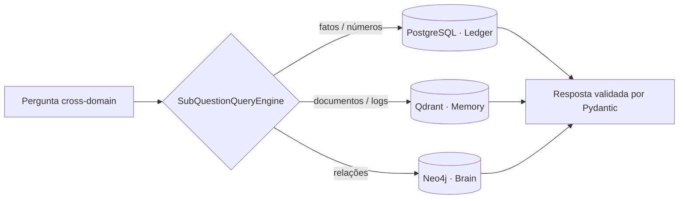

# DataOps Knowledge Hub

[English](README.md) · **Português**

RAG multi-fonte que roteia cada pergunta para a base mais adequada a respondê-la —
fatos exatos para SQL, busca semântica para o vetorial, relações para o grafo.
Construído com **LlamaIndex** e **Pydantic** durante minha especialização em
AI Data Engineer.

## Por que três bases?

Um vetorial sozinho responde bem *"o que é parecido?"* — mas alucina em *"quantos?"*
e não navega *"o que está conectado a quê?"*. Cada consulta vai para o engine feito
para ela:

| Camada | Base | Responde | Engine LlamaIndex |
|---|---|---|---|
| **Ledger** | PostgreSQL | exato / numérico / transacional | `NLSQLTableQueryEngine` (text-to-SQL) |
| **Memory** | Qdrant | semântico / documentos / logs | `VectorStoreIndex` |
| **Brain** | Neo4j | relações / linhagem | `PropertyGraphIndex` (Cypher) |

Por cima fica um **`SubQuestionQueryEngine`**: ele decompõe uma pergunta cross-domain
em sub-perguntas, roteia cada uma para o engine certo e junta os resultados. Toda
saída do LLM é convertida em um **schema Pydantic tipado** — nada de string crua.

> **Uma pergunta, as três bases:**
> *"Quais clientes enterprise gastaram mais de R$50k, tiveram incidentes de pipeline,
> e quais sistemas downstream seriam impactados?"*
> → gasto no **SQL** (Ledger), incidentes no **vetorial/logs** (Memory), impacto
> downstream no **grafo** (Brain).

## Arquitetura



Exposto de duas formas: um endpoint REST em **FastAPI** e um **MCP server**, para que
qualquer host MCP (incluindo o Claude) consuma como ferramenta.

## Demonstração

**Relações no grafo (Neo4j / Brain):**


**API REST (FastAPI) e uma consulta interativa (Swagger):**


**MCP server — o mesmo RAG respondendo dentro do Claude, com base nos dados do projeto:**


## Stack

Python · LlamaIndex · Pydantic v2 · FastAPI · PostgreSQL · Qdrant · Neo4j · SeaweedFS · MCP · Docker

## Como rodar

```bash
cp .env.example .env     # adicione sua OPENAI_API_KEY
make up                  # sobe Postgres, Qdrant, Neo4j (Docker)
make ingest              # indexa os dados de exemplo nas bases
make serve               # FastAPI em http://localhost:8000/docs
make query               # faz uma pergunta pelo terminal
```

## Notas

Construído durante minha especialização em AI Data Engineer como estudo prático de
padrões de RAG em produção. Os dados são sintéticos (gerados com Faker); o foco foi
implementar a recuperação multi-fonte de ponta a ponta — os três engines do
LlamaIndex, o roteador `SubQuestionQueryEngine`, e a exposição por REST e MCP.
